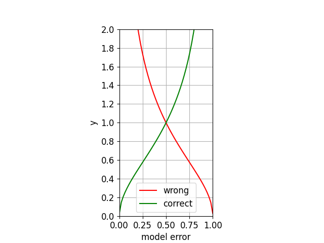

# example1
## Binay Classification

  - Training set    
  \\( h \\)차원 학습데이터 \\( x \\)이 N개 주워졌고 각 데이터에 레이블 \\( y \\) 또한 N개 주워졌다. 레이블이 1 또는 -1 값을 가지는 이진분류 문제이다.
  
  $$ (x_i,y_i) \ where \ i=1,\dots,N
  \newline  \ x_i \in \mathbb{R}^h, y_i \in Y = \{-1, 1\}$$ 

  - Data weight    
  각 학습데이터마다 중요도를 나타내는 가중치\\( D_i \\)가 있고, 이 가중치는 매 round마다 갱신되며 최대 T번 round가 진행된다. 초기 \\( t=1 \\) 에서 초기값은 \\( \frac{1}{N} \\)로 초기화된다.
  $$
  D_i^t \ where \  i=1,\dots,N \ t=1,\dots,T
  \newline 
  D_i^1=\frac{1}{N}
  $$

  - Model
    - Weak model    
    h 차원의 hyperplane으로 분류 하는 선형 모델로 표현했다. \\( sign\\) 함수는 입력값의 부호만 반환하여 0인 경우 0을 반환한다.      
      $$\widehat y = M_t(x_i) = sign(w_1*_1x_i+\dots+ w_h*_hx_i+ bias)$$
    - final model   
    $$ \widehat y = F(x) =sign(\sum_{t=1}^T{\alpha_t M_t(x)})$$

    - Model error   
    모델 에러 \\( \varepsilon_t \\)는 모델이 잘못 예측한 학습데이터의 가중치를 합한것이다. 모든 데이터에 대해서 다 틀린경우 1이되고, 다 맞힌경우 0이된다.   
    $$ \varepsilon_t = \sum_i^N D_i^tI(y_i \neq M_t(x_i)), \ where \ I(true)=1, \ I(flase) = 0 $$

    - Model weight
    $$\alpha_t = \frac{1}{2}\ln{\frac{1-\epsilon_t}{\epsilon_t}}$$

    - Data weight    
    기존 가중치를 업데이트한다. 
    $$D_i^{t+1}=\frac{D_i^{t}U_i^t}{\sum_{j=0}^{N}D_j^{t}U_j^t} $$    

    $$ U_i^t = \begin{cases} 
    \sqrt{\frac{e}{1-e}}, \ \ \ if\  y_i = M_t(x_i), \ correct \ case \\\\\\ 
    \sqrt{\frac{1-e}{e}}, \ \ \ if\ y_i \neq M_t(x_i) \ wrong \ case 
    \end{cases} $$

## Algorithm

&emsp;①. random error(0.5) 에서 가장 먼 \\( \varepsilon_t \\)를 갖는 모델 \\(M_t\\)를 찾는다.
$$ M_t = \argmax_M |0.5-\varepsilon_t|$$

&emsp;②. \\(\alpha_t\\)를 계산하여 모델을 추가한다.

&emsp;③. 만약 현재 찾은 모델의 성능이 매우 않좋다면 학습을 종료한다. random error(0.5)에 가까운 성능을 내는 모델일 수록 않좋다. \\(\beta\\) 는 사전 정의된 작은 값이다.
$$ |0.5-\varepsilon_t| \le \beta $$

&emsp;④. T번 반복했다면 학습을 종료한다.

&emsp;⑤. \\( D_{t+1} \\)을 업데이트하고 ①부터 다시 반복한다.

## Graph
  - Model Weight    
모델 가중치 \\(\alpha_t\\)는 수식(1)과 같이 모델 에러 \\(\epsilon_t\\)로부터 계산된다. 그래프로 그려보면 Figure.1과 같다. 만약 \(\epsilon_t\)가 0.5라면 \\(\alpha_t\\) 가 0이 되어서 해당 모델이 쓸모없다는것을 알수 있다. 반면 \\(\epsilon_t\\) 가 0과 1에 근접했을때 \\(\alpha_t\\)가 급격하게 각각 증가,감소하여 예측 기여도가 높아짐을 알수 있다.    

$$
\alpha_t = \frac{1}{2}\ln{\frac{1-\epsilon_t}{\epsilon_t}}
$$

<figure align="center">
<figcaption>Figure.1</figcaption>

</figure>

  - Update Data Weight    
  모델 에러에 따라서 x 축 값이 결정된후 현재모델의 각 샘플에 대한 결과에 따라 붉은선 초록선이 선택되어 y값이 결정된다. x값 0.5를 기준으로 error가 더 많은 모델인지 아닌지가 나눠지게 되고 결과를 반대로 해석하게된다. 즉 나쁜 모델의 결과을 반대로 해석하면 정답이되기때문이다. 만약 x값이 0.1이라면 모델 에러가 작고 출력결과를 믿는것이 더 좋다고 볼수 있다. 그래서 맞춘 샘플에대해서는 가중치를 줄이고 틀린 샘플에대해서 가중치를 높인다.
  반대로 x값이 0.9라면 모델 에러가 크고 틀릴확률이 더 높은 모델이다. 그래서 틀린 샘플은 맞은 샘플로 해석되어 적은 가충치가 적용되고 반대로 맞은 샘플은 틀린것으로 해석되어 높은 가중치를 적용한다.
$$
e^{0.5\ln{\frac{1-e_t}{e_t}}}=\sqrt{\frac{1-e_t}{e_t}}
$$

$$
U_i^t = \begin{cases} 
\sqrt{\frac{e}{1-e}}, \ \ \ if\  y_i = M_t(x_i), \ correct \ case \\\\\\
\sqrt{\frac{1-e}{e}}, \ \ \ if\ y_i \neq M_t(x_i) \ wrong \ case
 \end{cases}
\newline    
\newline    
$$ (2)
<figure align="center">
<figcaption>Figure.1</figcaption>

</figure>