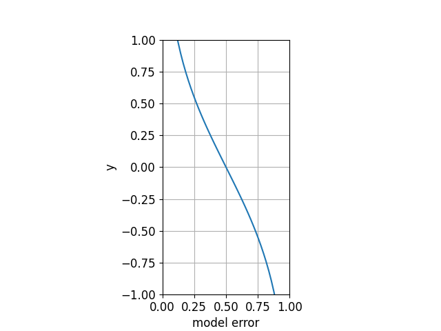
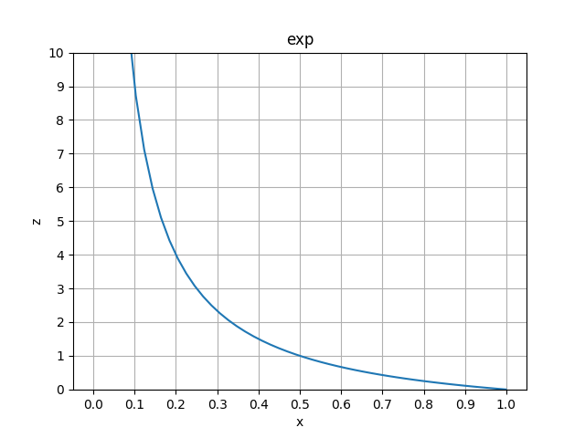

# example1
## Binay Classification

## Model Weight
모델 가중치 \(\alpha_t\)는 수식(1)과 같이 모델 에러 $\epsilon_t$로부터 계산된다. 아래 그림`alpha`
는 그래프로 표현한것이다. 만약 \(\epsilon_t\)가 0.5라면 \(\alpha_t\) 가 0이 되어서 해당 모델이 쓸모없다는것을 알수 있다. 반면 \(\epsilon_t\) 가 0과 1에 근접했을때 \(\alpha_t\)가 급격하게 각각 증가,감소하는것을 볼수 있다.    

$$\alpha_t = \frac{1}{2}\ln{\frac{1-\epsilon_t}{\epsilon_t}} \tag{1}$$

<figure>
<figcaption>Figure.1</figcaption>

</figure>

## Update Data Weight
$$D_i^{t+1}=\frac{}{}$$
